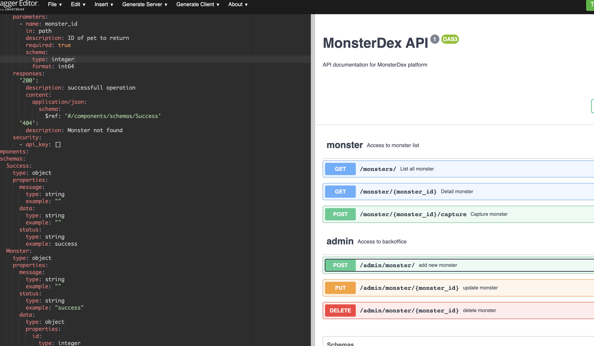

# MonsterDex simple application

## About
This is simple project to handle manage monster and captured

### API Docs
This project contain api doc locate in `script/api-doc.yaml`. The doc in yaml format with swagger verified syntac.

#### how to get html printed doc
- open `https://editor.swagger.io/`
- copy & paste `api-doc.yaml`
- swagger html formatted done

## Getting started
### Layout
```sh
monsterdex/
├── bin                                 
├── cmd
│     └── api                           # Entry point of main application
├── files                               # configuration files
├── internal                            # Contains all internal packages
│     ├── config                        # Package that provides configuration for the application
│     ├── model                         # model will store model
│     │     └── tbd.go 
│     ├── repository                    # Repository handler
│     │     └── tbd
│     ├── usecase                       # Usecase handler
│     │     └── tbd
│     ├── mocks                         # Mock files for repository & usecase
│     │     └── mockTbd.go
│     └── delivery                      # Delivery layer
```

### Mock Tool

This repo uses mockgen for generating mocks.
Mock files are placed within `mocks` folder.

### How to run
- import sql (in here use PostgreSQL)\
locate in `script/schema.sql`
- run service\
    - jump in directory `cmd/rest`
    - run `go run app.go`
